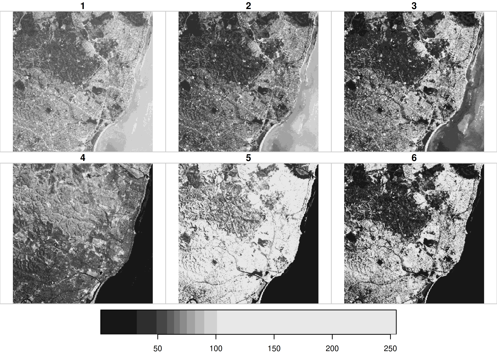
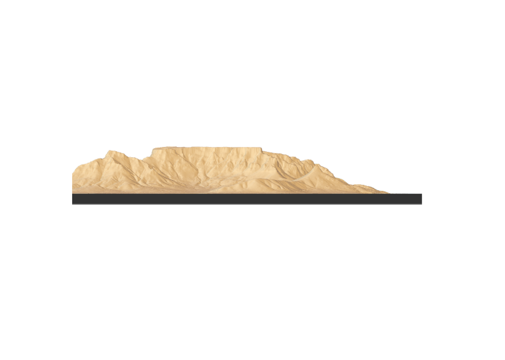

*Note: This is a bonus set of notes, meant to read alongside the main spatial lecture. Yes, I know I said we won't have time for rasters, but I caved. I might turn these notes into a formal lecture down the road. We'll see.*

## Requirements

### R packages 

- New: **stars**, **raster**, **sp**, **spDataLarge**, **rcartocolor**, **rayshader**
- Already used: **sf**, **tidyverse**, **httr**, **hrbrthemes**, **viridis**, **remotes**, **here**

I know that there are a lot of packages here, but don't worry: There are only a few core raster spatial packages that we need to care about. The rest are mostly just for adding a few bells and whistles to these notes. As always, I'll try to be explicit about why I'm using a particular function and which package it belongs to. I should also say that the **sf** package that we used in the previous lecture, will automatically get loaded alongside **stars**. Same for the **sp** package, which will get loaded alongside **raster**. The following code chunk should take care of all of that for you.


```r
if (!require("pacman")) install.packages("pacman")
pacman::p_load(raster, stars, tidyverse, httr, hrbrthemes, viridis, rcartocolor, remotes, rayshader, here)
pacman::p_load_gh("Nowosad/spDataLarge")
theme_set(hrbrthemes::theme_ipsum()) ## Optional: my preferred ggplot2 theme
```


## Introduction: Raster basics

### Tesselation (gridding)

Additional dimensions for vector datacubes, e.g. satellite data typically comes with time dimension too.


### Files types (GeoTIFF, NetCDF, etc.)

Raster (and datacube) data come in many different formats. The two most common file types that you are likely to encounter are: 

- **GeoTIFFs** (`.tif`) Geographic Tagged Image File Format
- **NetCDF** (`.nc`), or "Network Common Data Form". 

## Packages for raster data in R


```r
ob_tif = system.file("tif/L7_ETMs.tif", package = "stars")
ob = read_stars(ob_tif)
ob
```

```
## stars object with 3 dimensions and 1 attribute
## attribute(s):
##   L7_ETMs.tif    
##  Min.   :  1.00  
##  1st Qu.: 54.00  
##  Median : 69.00  
##  Mean   : 68.91  
##  3rd Qu.: 86.00  
##  Max.   :255.00  
## dimension(s):
##      from  to  offset delta                       refsys point values    
## x       1 349  288776  28.5 +proj=utm +zone=25 +south... FALSE   NULL [x]
## y       1 352 9120761 -28.5 +proj=utm +zone=25 +south... FALSE   NULL [y]
## band    1   6      NA    NA                           NA    NA   NULL
```

As mentioned earlier, **stars** is tightly integrated with **sf**. Many of the corresponding `st_SOMETHING()` functions that we learnt about last lecture will hence work on raster arrays and datacubes too. For example,  we can get the spatial extent (or "bounding box") of our `ob` object.


```r
st_bbox(ob)
```

```
##      xmin      ymin      xmax      ymax 
##  288776.3 9110728.8  298722.8 9120760.8
```


```r
plot(ob)
```

<!-- -->


```r
# srtm = raster::raster(system.file("raster/srtm.tif", package = "spDataLarge"))
srtm = read_stars(system.file("raster/srtm.tif", package = "spDataLarge"))
zion = st_read(system.file("vector/zion.gpkg", package = "spDataLarge"))
```

```
## Reading layer `zion' from data source `/usr/lib/R/library/spDataLarge/vector/zion.gpkg' using driver `GPKG'
## Simple feature collection with 1 feature and 11 fields
## geometry type:  POLYGON
## dimension:      XY
## bbox:           xmin: 302903.1 ymin: 4112244 xmax: 334735.5 ymax: 4153087
## epsg (SRID):    NA
## proj4string:    +proj=utm +zone=12 +ellps=GRS80 +towgs84=0,0,0,0,0,0,0 +units=m +no_defs
```

```r
# zion = st_transform(zion, raster::projection(srtm))
zion = st_transform(zion, st_crs(srtm))
```


```r
# srtm_cropped = raster::crop(srtm, zion)
srtm_cropped = st_crop(srtm, zion)
```

```
## although coordinates are longitude/latitude, st_intersects assumes that they are planar
```

```r
srtm_cropped2 = srtm[zion] ## another option
```

```
## although coordinates are longitude/latitude, st_intersects assumes that they are planar
```

```r
# srtm_masked = raster::mask(srtm, zion)
srtm_masked = st_crop(srtm, zion, crop = FALSE) ## keep full extent, but convert outside values to NA
```

```
## although coordinates are longitude/latitude, st_intersects assumes that they are planar
```


```r
# plot(srtm_cropped, col = terrain.colors(100))
# plot(srtm_cropped, col = viridis::magma(100))
plot(srtm_cropped, col = rcartocolor::carto_pal(name="TealRose"))
```

<!-- -->


```r
ggplot() +
  geom_stars(data = srtm_cropped) +
  scale_fill_carto_c(
    name = "Elevation", palette = "Geyser", 
    na.value = "transparent" ## Optional
    ) +
  theme_void()
```

<!-- -->

## Fun stuff: rayshader


```r
# library(rayshader)  ## Already loaded

srtm_mat = raster_to_matrix(as(srtm, "Raster"))
srtm_mat %>%
  sphere_shade(sunangle = 45, texture = "desert") %>%
  add_shadow(ambient_shade(srtm_mat), 0) %>%
  plot_map()
```

<!-- -->


```r
srtm_mat %>%
    sphere_shade(sunangle = 45, texture = "desert") %>%
    add_shadow(ambient_shade(srtm_mat), 0) %>%
    plot_3d(srtm_mat, zscale = 30, fov = 0, theta = 135, zoom = 0.75, phi = 45, windowsize = c(1000, 800))
Sys.sleep(0.2)
render_snapshot(clear=TRUE)
```

<!-- -->

### Another example: Cape Town

Let's walk through another example to see how we can download, extract, and then view (part of) a large GeoTIFF file. Naturally, I'm going to choose my home city of Cape Town because it has really neat topography and is also objectively the best city. The digitial elevation raster that we're going to use comes courtesy of the City of Cape Town's [Open Data Portal](https://odp-cctegis.opendata.arcgis.com/).  https://web1.capetown.gov.za/web1/opendataportal/DatasetDetail?DatasetName=Digital%20elevation%20model).

You can download the file manually [here](https://web1.capetown.gov.za/web1/opendataportal/DatasetDetail?DatasetName=Digital%20elevation%20model) and then unzip it, but here some commands to do everything from R. *Warning:* Depending on your internet connection, the next code chunk might take a minute or two to run.


```r
# library(httr) ## Already loaded 
# library(here) ## Already loaded. Just to help with relative directory paths for file downloading.

## Download the file from the City of Cape Town (but only if needed)
if(!file.exists(here("09a-spatial-rasters/data/10m_Grid_GeoTiff.zip"))) {
  httr::GET(
    'https://www.capetown.gov.za/_layouts/OpenDataPortalHandler/DownloadHandler.ashx?DocumentName=10m_Grid_GeoTiff.zip&DatasetDocument=http%3a%2f%2fcityapps.capetown.gov.za%2fsites%2fopendatacatalog%2fDocuments%2fDigital%2520elevation%2520model%2f10m_Grid_GeoTiff.zip', 
    httr::write_disk(here("09a-spatial-rasters/data/10m_Grid_GeoTiff.zip"))
    )
}

## Upzip it (but only if needed)
if(!dir.exists(here("09a-spatial-rasters/data/10m_Grid_GeoTiff"))) {
  unzip(
  here("09a-spatial-rasters/data/10m_Grid_GeoTiff.zip"),
  exdir = here("09a-spatial-rasters/data/10m_Grid_GeoTiff")
  )
}
```

Now we read in the whole file (+/- 130 MB).


```r
cpt = read_stars(here("09a-spatial-rasters/data/10m_Grid_GeoTiff/10m_Grid_GeoTiff/10m_BA.tif"))
```

Let's plot it. The object size will cause this to take a few seconds to render.


```r
plot(cpt, col = viridis::magma(20))
```

<!-- -->

Here we see the whole peninsula and greater metropolitan area: northern suburbs, etc. However, the part that I (and thus you) are particularly interested in is the [City Bowl](https://en.wikipedia.org/wiki/City_Bowl).^[This is the natural ampitheatre formed by Table Bay and the surrounding mountains, including most famously, Table Mountain.] There are several ways to limit our elevation data to this extent. In the below code chunk I've taken the shortcut of providing a reasonable bounding box that we can use to crop against.


```r
bb = 
  st_bbox(
    c(xmin = -60000, ymin = -3761000, xmax = -50000, ymax = -3751500),
    crs = st_crs(cpt)
    ) %>%
  st_make_grid(n = 1)

## Crop to the City Bowl
cpt_cb = st_crop(cpt, bb)

## Plot (have to use less colours b/c there's less elevation breaks in the cropped data)
plot(cpt_cb, col = viridis::magma(18))
```

<!-- -->


Let's rayshade this bad boy.


```r
cpt_cb = raster_to_matrix(as(cpt_cb, "Raster"))
cpt_cb %>%
  sphere_shade(sunangle = 45, texture = "desert") %>%
  add_shadow(ambient_shade(cpt_cb), 0) %>% ## comment out if rendering takes a while
  add_water(detect_water(cpt_cb), color = "desert") %>%
  plot_map()
```

<!-- -->
[
For the iconic image --- i.e. looking out to the flat table top of the mountain from the harbour --- we just need to just our camera angle a little bit.


```r
cpt_cb %>%
  sphere_shade(sunangle = 45, texture = "desert") %>%
  add_water(detect_water(cpt_cb), color = "desert") %>%
  plot_3d(
    cpt_cb, zscale = 10, fov = 0, theta = 180, phi = 0, zoom = 0.5
    )
Sys.sleep(0.2)
render_snapshot(clear=TRUE)
```

<!-- -->

FWIW, here's the real thing, courtesy of [Wikipedia](https://en.wikipedia.org/wiki/Table_Mountain). Ain't she a beauty?


